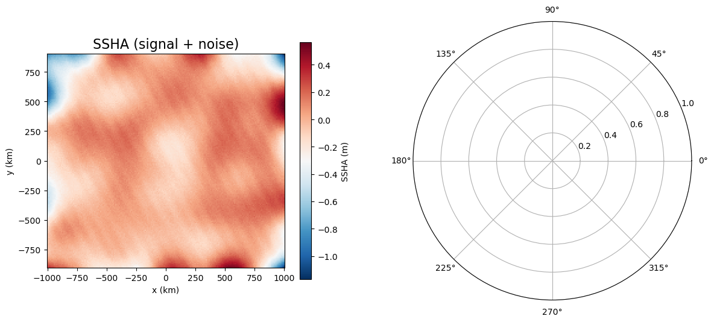

# Summary

Internal tides are internal gravity waves generated by the interaction of barotropic tides with seafloor topography. They are a primary driver of ocean mixing and play a vital role in the global energy budget. In this paper, we introduce PlaneWaveFit, an open-source software package with a Python interface that extracts the amplitude, phase, and propagation direction of internal tides from Sea Surface Height (SSH) observations, with uncertainty estimates for both amplitude and phase provided. 

The software implements a two-dimensional plane-wave fitting approach to resolve multiple wave components. It is broadly applicable to data from satellite missions, such as the Surface Water and Ocean Topography (SWOT) mission, numerical ocean model outputs, and synthetic datasets. It also provides built-in access to precomputed internal tide parameters derived from the climatology in the World Ocean Atlas dataset. These parameters specifically target the dominant mode-1 $M_2$ internal tide and include the necessary conversion ratios to calculate depth-integrated energy and energy flux directly from the fitted surface amplitudes.


Figures can be included like this:

and referenced from text using \autoref{fig:example}.


# Statement of need

High-resolution ocean observations and numerical models provide two-dimensional sea surface height (SSH) snapshots that resolve small-scale features. However, identifying internal tides in these datasets is challenging because the tidal signal is often obscured by vigorous mesoscale eddies and ocean fronts.

Commonly used packages like `UTide` or `T_TIDE` are designed for temporal harmonic analysis at fixed locations. While effective for stationary records like tide gauges, they do not resolve the spatial propagation or directionality of internal tides. PlaneWaveFit addresses this limitation by implementing a two-dimensional fitting approach that extracts $M_2$ internal tides that are both spatially and temporally coherent. This dual coherence constraint makes the method significantly less sensitive to mesoscale contamination compared to purely temporal analysis, allowing for the robust detection of tidal beams even in energetic ocean regions.

# State of the field

Two-dimensional plane-wave fitting has been widely applied to extract low-mode internal tidal signals from both multi-satellite altimetry data [@zhao2011internal; @zhao2016global; @zhao2017global; @zaron2019baroclinic; @zhao2024internal]. PlaneWaveFit provides a open-source implementation of this method along with uncertainty estimates for amplitude and phase.

The package also complements theoretical vertical mode solvers such as `dynmodes`, which compute theoretical vertical mode structures and eigenspeeds from stratification profiles. First, for users who do not have a prescribed wavenumber for their study region, the package provides integrated access to precomputed wavenumbers derived from global climatology, calculated using `dynmodes`. Second, once a fitted amplitude is obtained, the software provides the necessary conversion ratios—such as the ratio of depth-integrated energy to surface amplitude squared—to translate surface results into full-depth energy budgets. This modularity allows users to either perform a standalone 2D fit or utilize the included physical parameters to move from sea surface height to physical energy flux.

# Software design

Planewavefit includes two parts:
1.  Internal-tide Parameter Lookup.
<!--
This notebook provides an example to access global internal tide parameters achived on Zenodo. These parameters were generated using `dynmodes` based on the World Ocean Atlas 2023 (WOA23) climatology. While `dynmodes` provides theoretical vertical mode structures and eigenspeeds from stratification profiles, this dataset provides additional conversion factors to link these vertical modes to surface observations. Once fitted amp is get, ... can be calculated. allowing users to retrieve depth integrated energy estimates without performing vertical integration themselves.
-->
The package provides routines to retrieve a global dataset of mode-1 $M_2$ internal tide parameters archived on Zenodo (https://doi.org/10.5281/zenodo.18423546). Included in this dataset are vertical normal mode structures, eigenspeeds, and horizontal wavenumbers. Additionally, it provides precomputed conversion ratios that link SSH amplitudes to interior physical properties, such as maximum vertical displacement, depth-integrated potential, kinetic, and total energy as well as energy flux. By providing these parameters, it enables users to translate fitted surface amplitudes directly into full-depth energy estimates without manual vertical integration of stratification profiles. For the full physical derivation of these ratios, please refer to the associated publication (DOI to be inserted after preprint is released).

2. Plane-Wave Fitting
Internal tide parameters (amplitude $A$, phase $\phi$, and direction $\theta$) are estimated by fitting plane waves to SSHA. For a specified tidal frequency $\omega$ and horizontal wavenumber $k$ (provided by the user or obtained from the precomputed lookup table), the wave field is written as:

$$\eta(x, y, t) = \sum_{m=1}^{N} A_m \cos(k_{x,m} x + k_{y,m} y - \omega t - \phi_m)$$

The optimal propagation direction $\theta$ is determined using a directional scanning approach. The algorithm evaluates all azimuths from $1^\circ$ to $360^\circ$; at each angle, a linear least-squares problem is solved to estimate the sine and cosine coefficients $(\beta_1, \beta_2)$. The direction associated with the maximum fitted amplitude is selected as the dominant propagation direction for the wave component under consideration.

Following the selection of the optimal propagation direction, parameter uncertainties are estimated from the covariance matrix of the least-squares solution. The covariance is derived from the residual variance of the fitted model.

# Usage Examples


The following example illustrates the use of fit_wave functionality to extract wave amplitude, phase, and direction from SWOT data. Note that the ssh data is achived in zenodo, and will be downloaded to a path /data/zenodo.

```python


from zenodo_get import download


# 1. Downloads the SWOT ssha example dataset
doi = "10.5281/zenodo.18408783"
ssha_fn = "SWOT_CalVal_SSHA_35W_35p5S.nc"
data_dir = Path("data/zenodo")
download(record_or_doi=doi, output_dir=data_dir, file_glob=ssha_fn,)

# 2. plot a snapshot of ssha

fig, ax = plt.subplots(figsize=(6, 4))
pcm = ax.pcolormesh(
    ds.longitude,
    ds.latitude,
    ds.ssha.isel(num_cycles=cycle),
    shading="auto",
    cmap="RdBu_r"
)
cbar = plt.colorbar(pcm, ax=ax)
cbar.set_label("SSHA (m)")
ax.set_xlabel("Longitude (°)")
ax.set_ylabel("Latitude (°)")
ax.set_title(f"SWOT SSHA (cycle {cycle})")
ax.set_aspect("equal", adjustable="box")
plt.tight_layout()
plt.show()


# 3. calculate x and y from lon and lat
lon_example, lat_example = -35, -35.5
distX, distY = utils.lonlat2xy(ds.longitude.values, ds.latitude.values, lon_example, lat_example) 

# 4. Load prescribed wave parameters: wave frequency and wavenumber
omega = 2 * np.pi / (12.42 * 3600) * 24 * 3600   # M2 frequency [rad/day] 12.42 h
k = 0.04124732611475162 # wavenumber [rad/km]


# 5 make x y t data all into dimensions (num_cycles, num_lines, num_pixels)
ssha = ds['ssha'].values  # SSHA (m)
X_3D      = np.repeat(distX[np.newaxis, :, :], ds.sizes['num_cycles'], axis=0)   # x [km]
Y_3D      = np.repeat(distY[np.newaxis, :, :], ds.sizes['num_cycles'], axis=0)   # y [km]
T_3D_dt64 = np.repeat(ds['time'].values[:, :, np.newaxis], ds.sizes['num_pixels'], axis=2)   # datetime64
T_3D      = utils.datetime64_to_matlab_datenum(T_3D_dt64)                           # decimal days since 0000-01-01


# Returns amplitude, direction, phase, and full uncertainty dictionary
amp, direction, phase, _, _, _, _, uncert = fit_wave(
    data_3D, local_k, omega_M2, ds['x'].values, ds['y'].values, ds['time'].values
)

# 6 Apply the Plane Wave Fit code
max_amplitude1, max_angle1, phase1, best_predicted_wave1, residual_variances1, amplitudes1, phases1, uncertainty_estimates1 = utils.fit_wave(ssha, k, omega, X_3D, Y_3D, T_3D)
max_amplitude2, max_angle2, phase2, best_predicted_wave2, residual_variances2, amplitudes2, phases2, uncertainty_estimates2 = utils.fit_wave(ssha - best_predicted_wave1, k, omega, X_3D, Y_3D, T_3D)
max_amplitude3, max_angle3, phase3, best_predicted_wave3, residual_variances3, amplitudes3, phases3, uncertainty_estimates3 = utils.fit_wave(ssha - best_predicted_wave1 - best_predicted_wave2, k, omega, X_3D, Y_3D, T_3D)


# Research impact statement

PlaneWaveFit provides a standardized, open-source implementation of 2D plane-wave fitting. The software has been validated in the Southern Ocean using SWOT data, where it successfully resolved coherent beams and tidal refraction and  within energetic eddy fields[@Li2024]. By integrating these fits with precomputed vertical mode parameters, the package further enables the direct conversion of fitted surface amplitudes into depth-integrated energy and energy flux. This capability allows researchers to quantify the full-depth internal tide energy budget solely from satellite altimetry, enabling the identification of specific geographic regions where tidal energy flux decays and supports turbulent mixing.


# AI usage disclosure

No generative AI tools were used in the development of this software, the writing of this manuscript, or the preparation of supporting materials.

# Acknowledgements
YL acknowledges support from a NASA FINESST award 80NSSC22K1529. STG and MRM were supported by the NASA SWOT science team (NASA awards 80NSSC20K1136 and  80GSFC24CA067). MRM was supported by NOAA awards NA23NOS4000334 and NA20OAR4320278, and the NASA Modeling, Analysis, and Prediction Program (Jet Propulsion Laboratory Subcontract 1716197). STG also acknowledges support from the Ocean Surface Topography Science Team (NASA 80NSSC21K1822).

# References

